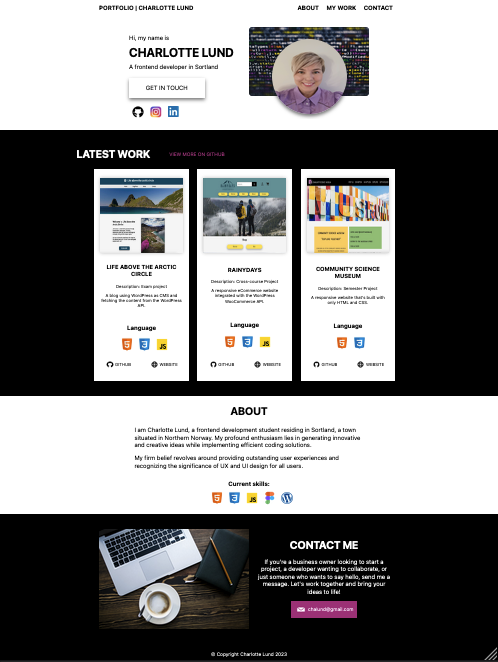

# Portfolio-1


## Table of Contents
* [Screenshot](#screenshot)
* [General info](#General-info)
* [Built with](#built-with)
* [Getting started](#getting-started)
* [Links](#Links) 
* [Contact](#contact)

## General info
Portfolio: Who I Am, Assignments, and Contact Information

Welcome to my portfolio! I'm Charlotte Lund, and I'm thrilled to share with you the assignments I have completed during my first year at Noroff. Below, you'll find a list of projects I've worked on, along with live links and GitHub repositories for easy access to my work. If you have any questions or would like to discuss potential collaborations, please feel free to reach out using the contact information provided.

### Assignments from First Year at Noroff:

- Exam Project: Life Above the Arctic Circle
- Cross-Course Project: Rainydays
- First Semester Project: Community Science Museum

Feel free to explore these projects to get a glimpse of my skills and expertise. Each assignment has a live link, allowing you to experience the websites firsthand, and a GitHub repository link for a detailed view of the code.

## Built with
This project is built using:
- HTML & CSS
- Javascript

## Getting started
### Installing
1. Clone the repo
```
git clone https://github.com/chalund/Portfolio-1.git
```
### Running
This project only contain static files, will run on all devices

## Links
[Link to site](https://portfolio-charlottelund.netlify.app)  


## Contact
Don't hesitate to get in touch if you have any questions or would like to discuss potential opportunities. I'm excited to connect with you and explore new possibilities together.

Email: [chalund@gmail.com]

[](chalund@gmail.com)
[](https://pe.linkedin.com/in/charlotte-lund-48419b249/)
[](https://github.com/chalund)